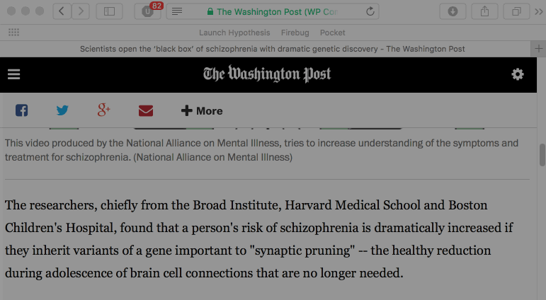
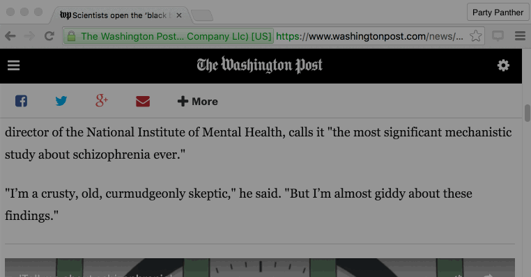

Two weeks ago I built the [first part][first-part] of a project to help me more actively read, recall what I read, and keep track of all the delightful bits of prose I come upon.

This week I finished up the project by 1) figuring out how to save highlighted text from any possible web page, and 2) building a way to nicely display all those interesting bits of text on a [web page][reading-highlights].

Also I created a GitHub organization to house all the code (really not a lot of code) for this.  Check it out and set it up for yourself: [https://github.com/reading-highlights](https://github.com/reading-highlights).

#### Design Summary



Here's a diagram of the design.  It uses [AWS SNS][sns] as a simple [pub/sub][pubsub] service, Google Spreadsheets as a database, and [AWS Lambda][lambda] functions to collect the highlights from various sources and then write them to the [spreadsheet][spreadsheet].  Then I use the [tabletop](https://github.com/jsoma/tabletop) library to pull from the spreadsheet and create a [nice looking web page][reading-highlights].

#### Details: Highlight Any Page
So after figuring out how to collect my [medium.com][medium] highlights, I needed to do the same for text I highlighted elsewhere on the web -- on the [New York Times][nyt], [The Atlantic][atlantic], [qz.com,][qz] or any other site I read.

There were really two problems to solve here:

*1. How do I highlight text while I'm reading it?*

Browsers do not provide a native way to highlight text -- like yellow-highlighter-highlight it -- although there seems to be an effort to define a standard by the W3C [Web Annotation Working Group][annotation-working-group].  This is great, but unfortunately doesn't help me much right now.

So after much searching, I found an open source project called [hypothes.is][hypothesis].  They have created a Chrome extension and a browser-agnostic bookmarklet allowing you to highlight (and annotate!) text on any web page.  It is based on an open source JavaScript library, [Annotator][annotator], which allows annotation functionality to be added to any web page.  I also really like the [overall goals][about-hypothesis] of [hypothes.is][hypothesis] including their non-profit status and that they are a contributor to the W3C Web Annotation Working Group.

Here's an example of the browser bookmarklet.

And here's an example of the Chrome extension in action.  They're pretty similar.  The only downside for me is that neither work or work very well in iOS Safari or Chrome.

*2. Now, how do I save the highlighted bits of text along with some metadata about the page?*

[Hypothes.is][hypothesis] also solves this problem.  In addition to highlighting the text in yellow, it saves the highlight plus metadata to [hypothes.is][hypothesis] databases.  And [hypothes.is][hypothesis] provides an [API][hypothesis-api] so that I can extract my highlights in a structured format and write them to a Google Spreadsheet.

#### Details: Display The Highlights
Once the highlights were stored in a Google Spreadsheet, I wanted a way to display them in a stylized format on the web.  I found a library on GitHub called [tabletop](https://github.com/jsoma/tabletop). Tabletop made it really easy to grab data from the spreadsheet and slap it in to a little [handlebars](http://handlebarsjs.com) template!

Here's a screenshot of the page. Check out [the live one here][reading-highlights].

#### Cheap
Oh yeah, I forgot to mention that all of the AWS pieces cost less than a dollar a month -- actually, likely less than $0.25 a month.

#### Questions?
Tweet at me, [@crc](https://twitter.com/crc), if you have questions or comments about this.  Also check out this talk if you're craving more on the power of highlighting and annotation: [The Revolution Will Be Annotated!][future]

[about-hypothesis]: https://hypothes.is/about/
[annotation-working-group]: http://www.w3.org/annotation/
[annotator]: http://annotatorjs.org
[atlantic]: http://www.theatlantic.com
[first-part]: /blog/2016/01/highlighting-the-internet/
[future]: https://www.youtube.com/watch?v=2jTctBbX_kw
[hypothesis]: https://hypothes.is
[hypothesis-api]: http://h.readthedocs.org/en/latest/api.html
[lambda]: https://aws.amazon.com/lambda/
[medium]: https://medium.com
[nyt]: http://www.nytimes.com
[pubsub]: https://en.wikipedia.org/wiki/Publish–subscribe_pattern
[qz]: http://qz.com
[reading-highlights]: /projects/reading/
[reading-highlight-github-org]: https://github.com/reading-highlights
[sns]: https://aws.amazon.com/sns/
[spreadsheet]: https://docs.google.com/spreadsheets/d/1VCkPCinhG-HiZJuvWPYq1wMIEpdHOdbCRF2lTDsOMBc/