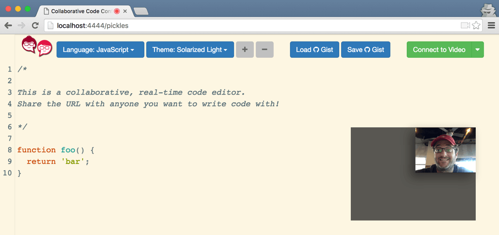

Recently I’ve been interviewing for Developer Relations roles. As a technical role, part of the interview process includes evaluation of my technical abilities. Or to put it more simply, writing code while a stranger peers over my shoulder. That normally happens one of two ways. If it’s an in-person interview, I’m writing code on a whiteboard. If it’s over the phone, I’m writing code in a shared Google Doc. Neither of these are how a developer normally writes code. Ever.[^1] There are tons of opinions out there [expounding](http://techcrunch.com/2015/03/21/the-terrible-technical-interview/) [how](https://medium.com/@ikeellis/i-will-not-do-your-tech-interview-80ba19c55883#.11gimpvu1) [technical](https://modelviewculture.com/pieces/technical-interviews-are-bullshit) [interviews](http://programmingisterrible.com/post/116698171738/nothing-is-more-indicative-of-a-bullshit-job-than) [are](https://medium.com/techtank-magazine/the-technical-interview-is-broken-and-sexist-2d9c3135af1e#.1xj22qazj) [broken](http://asserttrue.blogspot.com/2015/03/why-i-wont-go-on-any-more-tech-job.html), so I won’t go down that rabbit hole.

But I figured I could leverage my experiences to create a simple tool to solve a specific problem. Here it is:

Emphasis on the simple here.  My aim wasn't to create a full-blown interview workflow tool or to replicate all the functionality of an <abbr title="Integrated Development Environment">IDE</abbr>.

<h3 style="text-align: center;"><em>"I just wanted a simple way to code with someone remotely and interact with them like a human."</em></h3> 

As I talked to others about this, I realized it could be used for more than a technical interview:

* [remote pair programming](https://pragprog.com/book/jkrp/remote-pairing),
* helping a coworker debug a problem over the phone,
* tutoring a beginner programmer remotely...

[What else](https://twitter.com/intent/tweet?text=I+want+to+use+a+collaborative+code+editor+for...+(@crc))?

## Something like this doesn't exist already?

Surprisingly, no!  At least I didn't find anything free or nearly free that provides a video conference and a shared code editor and is open source[^2]. Know of something? Let me know ([@crc](https://twitter.com/crc))!

In my research I found lots of video conference tools -- some free, some not.  [Google Hangouts](https://hangouts.google.com), [Uber Conference](https://www.uberconference.com), [talky](https://talky.io), [Skype](http://www.skype.com), and many others provide video conferencing and/or screen sharing.  For shared code editing, there are also lots of options: [collabedit](http://collabedit.com), [kobra](https://kobra.io/#/), [Space](https://github.com/chaoscollective/Space_Editor), [Firepad](https://firepad.io/#1) (which serves as the underlying collaborative editor for some of these other ones), [Koding](http://www.koding.com), [CoderPad](https://coderpad.io), [Codebunk](https://codebunk.com), [codeassium](https://codassium.com), [Squad](https://squadedit.com), [Codeanywhere](https://codeanywhere.com), and [codeshare](https://codeshare.io).

None of these met all the criteria, which again were:

1. Combine video conference and collaborative code editing,
2. free, and
3. open source.

[Codeshare](https://codeshare.io) comes the closest but doesn't look to be open source.

## Try it out

Want to see it in action?  There are two ways to try it out.  

The best way is to click this button to make your own for free.

This will spin up your own private instance of the app for free.  You'll need Heroku and Twilio accounts if you don't already have them.  You'll also need to generate a few Twilio configuration tokens.  The URLs where you'll get these tokens will be shown to you.  It's really simple!

Or you can check out a [live demo](https://codie.herokuapp.com).  But note that the video/audio might not work if you or your coding amigo are behind a <abbr title="Network Address Translation">NAT</abbr> gateway.  To handle NAT, Twilio provides a [TURN](https://en.wikipedia.org/wiki/Traversal_Using_Relays_around_NAT) service that relays the audio and video.  I've disabled TURN relay for the demo app because it [costs money](https://www.twilio.com/stun-turn/pricing) and could generate a huge bill for me if hundreds of people start using it!

Please be nice and don't put anything on here that's private or you're not ok losing.

## How does it work?

From a high level there are two main pieces to the app: shared code editing and audio/video conferencing.  Here's a diagram showing how the different pieces communicate.



The audio/video conferencing uses [WebRTC](https://webrtc.org) to establish a peer-to-peer connection between your browser and your coding partner's browser.  [WebRTC support in the major browsers is getting better and better](http://caniuse.com/webrtc).  Peer-to-peer audio and video is fully implemented and stable in Chrome and Firefox.  And while there haven't been any official announcements, it looks like Apple is [working on adding WebRTC to Safari](https://webkit.org/status/#specification-webrtc) (hopefully including iOS Safari) in 2016.

The code editor is simply a giant `<textarea>` with some nice styling and functionality added by the great [CodeMirror](http://codemirror.net) project.  As you type, text changes are wrapped in changeset objects and shared with other browsers viewing the same document.  You can think of a changeset like a Git commit.  It represents a diff from one document state to another (and a pointer to its parent changeset).  Right now the changesets are sent over a [WebSocket](https://en.wikipedia.org/wiki/WebSocket) to the server and then broadcast out.  A future iteration might use a WebRTC data channel to share changesets obviating the need for an application server beyond a static file server.

## Security and Privacy

Since security and privacy are hot topics right now -- see [Apple and the FBI](http://www.theverge.com/2016/2/17/11036306/apple-fbi-iphone-encryption-backdoor-tim-cook) -- let me clearly state that the coding session is not guaranteed to be private.

There is no login functionality.  Anyone who has or guesses the URL of your code conference can see the code and the audio/video.  This means your coding session, while "obfuscated", is effectively public.

For those interested in reading more, here is a [detailed discussion of the security of WebRTC](http://webrtc-security.github.io) that passes my "bullshit meter" and I believe is accurate.  The WebRTC spec requires encryption, so the audio and video is encrypted from browser-to-browser.

#### Questions?
Tweet at me, [@crc](https://twitter.com/crc), if you have questions or comments about this!

[^1]: Developer tooling, coding environment, process are all things developers spend **days** customizing so they can be as efficient as possible.  Some might argue we spend too long tweaking our development environment.
[^2]: Free so that it is accessible to all and open-source so that you don't have to worry about the service provider going out of business and taking the service down with it.